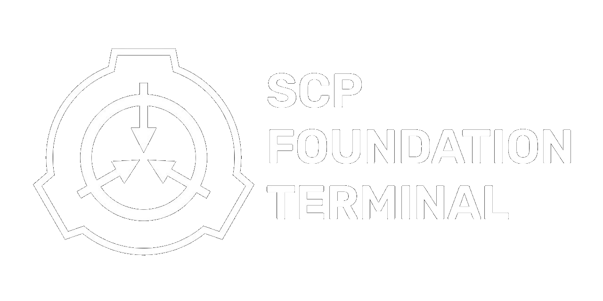

<h1 align="center">
  <br>
</h1>

# SCP Foundation Terminal

> **"Secure. Contain. Protect."**

A Python terminal program that retrieves SCP Wiki entries, displays them in a Foundation-themed console, saves local copies, supports user login/registration, and keeps activity logs.

> **Current Version:** v2.2.0

## Features

- **SCP lookup**: Retrieve SCP object information from the SCP Wiki.
- **Save to file**: Save SCP data as `.txt` files in `SCP object files/`.
- **Text-to-speech**: Read selected entry details aloud with local or online speech backends.
- **User registration and login**: Store simple local user profiles.
- **Emergency lockout**: Trigger the terminal lockout flow.
- **Incognito mode**: Browse without writing activity log entries.
- **Activity logging**: Store terminal actions in `Activity Logs/`.
- **Terminal override**: Use the admin-style override path.
- **Colored output**: Styled terminal UI with `colorama`.

## Project Structure

```text
SCP-Foundation-Terminal/
├── Activity Logs/          # Auto-generated session logs
├── SCP object files/       # Saved SCP data
├── Users/                  # Registered user data
├── scp_terminal.py         # Main terminal entry point
├── scp001.py               # SCP-001 special handler
├── chronicle_engine.py     # Activity logging helpers
├── register.py             # User registration module
├── lockout.py              # Emergency lockout handler
├── speech_engine.py        # Text-to-speech wrapper
├── requirements.txt        # Python dependencies
├── scp.png                 # SCP Foundation logo
└── LICENSE
```

## Requirements

- Python 3.10+
- Packages from `requirements.txt`

Install dependencies:

```bash
pip install -r requirements.txt
```

## Speech

The terminal tries local Windows speech first, then falls back to online Google Text-to-Speech playback if the local SAPI voice driver is unavailable.

To force a specific backend:

```bash
$env:SCP_TERMINAL_SPEECH_BACKEND = "gtts"
python main.py
```

Supported values are `pyttsx3`, `powershell`, `gtts`, and `off`.

## Setup & Usage

1. Install dependencies:

   ```bash
   pip install -r requirements.txt
   ```

2. Register a new user:

   ```bash
   python register.py
   ```

3. Launch the terminal:

   ```bash
   python scp_terminal.py
   ```

4. Log in and start looking up SCP objects.

## Commands

| Command | Action |
| --- | --- |
| `scp-173` | Display and save a specific SCP entry |
| `random` | Display and save a random SCP entry |
| `del` | Delete saved SCP object files |
| `lock` | Start emergency lockout |
| `incog` | Enable incognito mode |
| `dis` | Disable incognito mode |
| `clean` | Delete activity logs |
| `clear` | Clear terminal output |
| `reg` | Register a new user |
| `profile` | Display current user information |
| `exit` | Close the terminal |

## Tech Stack

- **Language:** Python
- **Web scraping:** `requests`, `beautifulsoup4`
- **Text-to-speech:** `pyttsx3`, PowerShell SAPI, `gTTS`, `pygame`
- **Terminal styling:** `colorama`
- **Data source:** [scp-wiki.wikidot.com](https://scp-wiki.wikidot.com)

## License

MIT - Copyright (c) 2026 Ashfaaq Rifath
